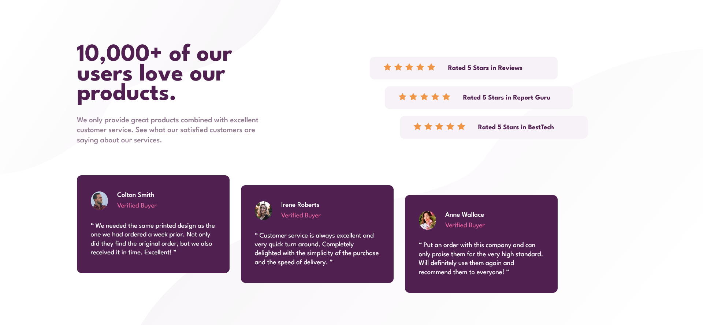

# Frontend Mentor - Social proof section solution

This is a solution to the [Social proof section challenge on Frontend Mentor](https://www.frontendmentor.io/challenges/social-proof-section-6e0qTv_bA).

## Table of contents

- [Overview](#overview)
  - [Screenshot](#screenshot)
  - [Links](#links)
- [My process](#my-process)
  - [Built with](#built-with)
  - [What I learned](#what-i-learned)
  - [Continued development](#continued-development)
- [Author](#author)

## Overview

My 8th challenge on the frontend mentor website.

Really took my time with this one, proud of the amount of attention to detail present in here, went as far as to match the exact quotation marks used in the design.
working with backgrounds was fun as will, took a while to get it as close to perfection as possible.
the responsiveness was a challenge in here as well, overall I LEARNED SO MUCH from this one and had fun in the process.

I'd say it very well may be the biggest one I've done so far with many things to pay attention to, so feeling real good about this one afterall.

### Screenshot

### Links

- Solution URL: (https://www.frontendmentor.io/solutions/social-proof-section-grid-flexbox-y9nNzhhUFB)
- Live Site URL: (https://social-proof-section-saif.netlify.app/)

## My process

### Built with

- HTML
- CSS
- Flexbox
- CSS Grid
- Mobile-first workflow

### What I learned

- backgrounds, as I said before more practice with backgrounds is always ALWAYS welcome!
  tinkered a lot with backgrounds in this one, and what's beautiful is that I'm very much just scratching the surface here! I found a couple of guides I intend to follow for some more background practice asap.

### Continued development

Will be focusing on tinkering more and more with backgrounds for the immediate future.

## Author

- Frontend Mentor - [@SafeNSound95](https://www.frontendmentor.io/profile/SafeNSound95)
